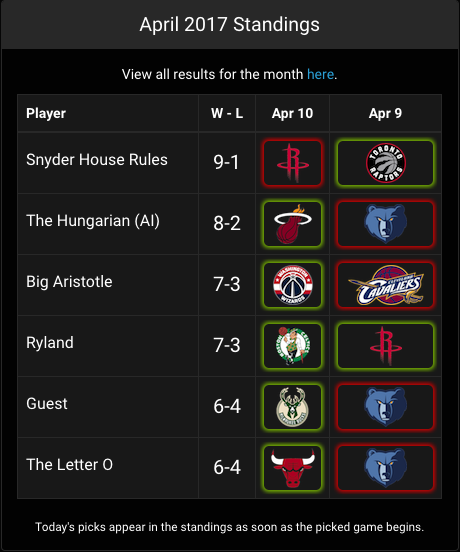

# Pigeon Hoops: An NBA Predictions Game

## Usage
Sign up at [nba.ryland-bell.com](nba.ryland-bell.com).
## About

### The Game
This is a monthly competition. Players pick the winner of one NBA game for each day, with the restriction that they can pick each team no more than once per month. The player with the most correct picks at the end of the month wins.

Implementing this simple game as a web application involved several challenges:

### Tracking NBA schedule data and user picks

The central requirement for the app is a way to display games in a way that allows users to track their picks and strategize about how to spread them throughout the month.

On the back-end, I've chosen to use two models to track games and picks. The `gameData` model tracks schedule and score data, received from an external API. The browser app can view this data, but never change it. 

Each user in a league is assigned an instance of the `userMonth` model every month. This model tracks both picks and their outcomes. Users are allowed to make or change picks at any point before the picked game begins. This gives them the flexibility to make all their picks at the beginning of the month, to make them each day as the month progresses, or anything in between.

In the browser, a React app combines `gameData` and `userMonth` data to generate a pick-tracking view. The each-team-once-per-month limitation is enforced in the browser and verified on the back-end. Teams that have already been picked are displayed with a dimmed name and logo, and generate warning displays when clicked.

While the rules of the game are simple, it can be cognitively draining to strategically think about 30 picks at once. To help, I added a component that displays all of a users picks for the month in one place, and allows quick navigation to different days in order to tweak them.

### Connecting users

At its heart, this is a social game, and so it's important to allow users to track each others' progress and to communicate. 

Users are grouped into leagues, with each user allowed to create or join as many leagues as they like. A component in the navbar allows users to quickly switch between different leagues, or to view past or upcoming months.

A standings component displays the current success record of every player in the league, as well as their outcomes for specific games. For strategic reasons, user picks are redacted from the standings until the picked game begins and the pick is locked in.

Finally, a simple chat component allows for the exchange of friendly banter within a league.

### Keeping score
The server app regularly runs a script to download new game outcome data from an external API, and uses it to mark user picks as correct or incorrect. This script, found in `~/app_api/controllers/scorekeeping`, requires a handful of asynchronous calls to the external API and my own database. To manage the timing for these, I wrote a chain of nested promises.

### Why "Pigeon Hoops"?
The process of picking 30 NBA teams over 28-31 days reminds me of the [pigeonhole principle](https://en.wikipedia.org/wiki/Pigeonhole_principle) from mathematics. Plus, I think it sounds cool. 😎 

## Possible Next Steps:
* Implement a tie-breaking rule.
* Allow account creation with Google/Facebook credentials via OAuth.
* Invite friends to join a league with a URL, rather than a league ID code.

## License

MIT License

Copyright (c) 2017 Ryland Bell

Permission is hereby granted, free of charge, to any person obtaining a copy
of this software and associated documentation files (the "Software"), to deal
in the Software without restriction, including without limitation the rights
to use, copy, modify, merge, publish, distribute, sublicense, and/or sell
copies of the Software, and to permit persons to whom the Software is
furnished to do so, subject to the following conditions:

The above copyright notice and this permission notice shall be included in all
copies or substantial portions of the Software.

THE SOFTWARE IS PROVIDED "AS IS", WITHOUT WARRANTY OF ANY KIND, EXPRESS OR
IMPLIED, INCLUDING BUT NOT LIMITED TO THE WARRANTIES OF MERCHANTABILITY,
FITNESS FOR A PARTICULAR PURPOSE AND NONINFRINGEMENT. IN NO EVENT SHALL THE
AUTHORS OR COPYRIGHT HOLDERS BE LIABLE FOR ANY CLAIM, DAMAGES OR OTHER
LIABILITY, WHETHER IN AN ACTION OF CONTRACT, TORT OR OTHERWISE, ARISING FROM,
OUT OF OR IN CONNECTION WITH THE SOFTWARE OR THE USE OR OTHER DEALINGS IN THE
SOFTWARE.